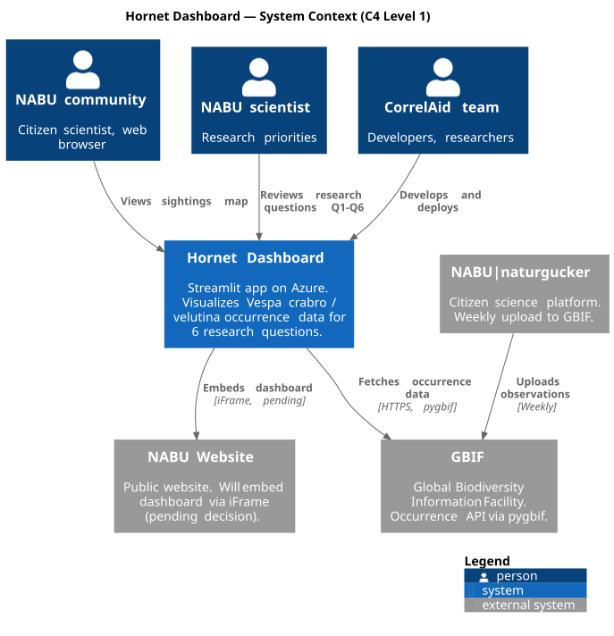
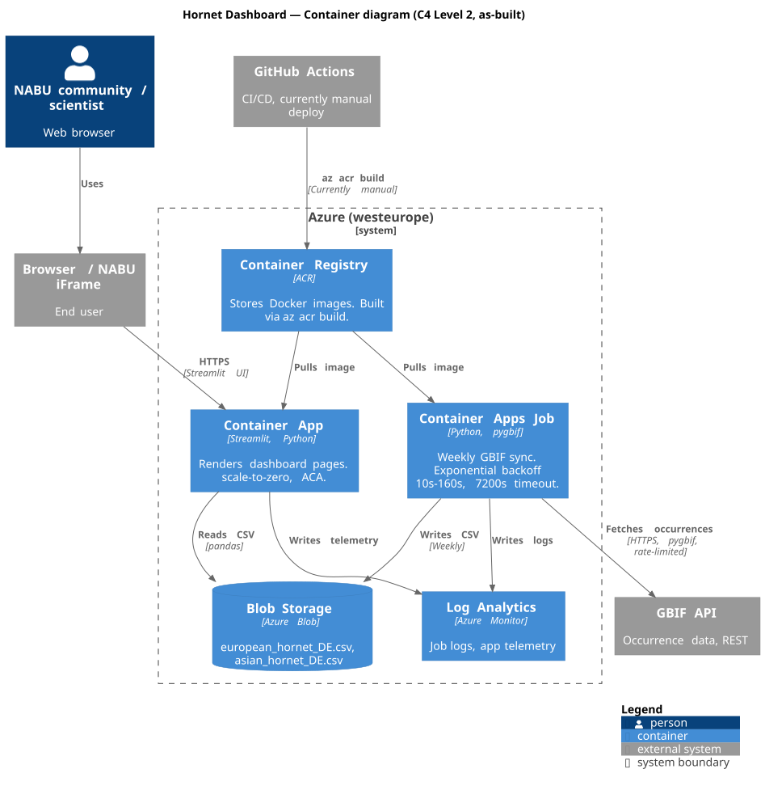

# 🐝 NABU Hornet Dashboard — Streamlit Prototype

**Project:** CorrelAid × NABU (Naturschutzbund Deutschland)

**Purpose:** Exploratory prototype for analyzing the spread of *Vespa crabro* (European hornet) and *Vespa velutina* (Asian hornet) using GBIF occurrence data.

[](https://hornet-dashboard.streamlit.app/)

---

## 📋 Table of Contents

- [Overview](#overview)
- [Tech Stack](#tech-stack)
- [Architecture](#architecture)
- [Research Questions](#research-questions)
- [Data Layer](#data-layer)
- [Design Decisions](#design-decisions)
- [Known Limitations](#known-limitations)
- [Getting Started](#getting-started)

---

<a id="overview"></a>
## Overview

This dashboard is a **rapid prototype** built to explore and visualize hornet occurrence patterns across Central Europe. It covers six research questions relevant to NABU's conservation monitoring work, from species displacement and habitat preference to climate influence and protected area presence.

> ⚠️ This is a **Streamlit prototype**, not the final product. The production dashboard will be implemented in **Django + HTMX**.


## What is Streamlit?

**Streamlit** is a Python library for quickly building interactive web dashboards for data without any web development knowledge.

**Core idea:** unlike Jupyter Notebooks where code and thinking process are visible, Streamlit shows only the results — which is exactly what non-technical stakeholders need.

**Three key advantages:**
- pure Python — no HTML/CSS/JS required
- rapid prototyping — dashboard in minutes
- automatic interactivity — sliders and buttons without complex code

**For the NABU project:** Streamlit enables quick presentation of hornet distribution analysis as interactive maps and charts — without web development overhead at the prototyping stage.


---

<a id="tech-stack"></a>
## 🛠️ Tech Stack

### Data & Analysis
| Library | Version | Purpose |
|---|---|---|
| `pandas` | 2.2.3 | Data manipulation and cleaning |
| `pygbif` | 0.6.4 | GBIF API client for occurrence data |
| `requests` | 2.32.5 | HTTP calls to Open-Meteo climate API |
| `gdown` | 5.2.0 | Downloading pre-built CSVs from Google Drive |

### Visualization
| Library | Version | Purpose |
|---|---|---|
| `plotly` | 5.24.0 | Interactive charts and maps |
| `folium` | 0.18.0 | Leaflet.js-based interactive maps |
| `streamlit-folium` | 0.24.0 | Folium map rendering inside Streamlit |

### App Framework
| Library | Version | Purpose |
|---|---|---|
| `streamlit` | 1.43.0 | Multi-page web app and UI components |

### External APIs
| API | Usage |
|---|---|
| [GBIF Occurrence API](https://www.gbif.org/developer/occurrence) | Species observation records |
| [Open-Meteo ERA5 Archive](https://open-meteo.com/en/docs/historical-weather-api) | Historical daily temperature data (2010–2023) |

### Infrastructure
| Tool | Purpose |
|---|---|
| Google Drive | Hosting pre-downloaded GBIF CSV datasets for Germany |
| Streamlit Community Cloud | App deployment and hosting |
| GitHub | Version control and team collaboration |

---

<a id="architecture"></a>
## 🏗️ Architecture

Multi-page Streamlit application with a shared data loading utility:

```
streamlit_app.py            # Main dashboard — overview metrics, timeline, map
utils/
  gbif_loader.py            # Shared data loading, caching, and cleaning logic
pages/
  1_Overview.py             # Q1 — Species displacement & overlap map
  2_Displacement.py         # Q2 — European hornet geographic distribution
  3_Distribution.py         # Q5 — Synanthropic behavior (urban vs. rural)
  4_Habitat.py              # Q3 — Habitat type analysis
  4_Urban_Rural.py          # (placeholder — not yet implemented)
  5_Protected_Areas.py      # Q4 — Presence in protected areas
  6_Climate.py              # Q6 — Climate & weather influence
download_gbif.py            # Standalone script: bulk-download GBIF data to CSV
data/                       # Local CSV cache (gitignored — large files)
```

---

<a id="research-questions"></a>
## 🔬 Research Questions

| Page | Research Question | Key Visualizations |
|---|---|---|
| **Main** | Overview of both species | Timeline (line chart), scatter map |
| **Q1 — Overview** | Is the European hornet being displaced? | Overlap scatter map, bar chart by Bundesland |
| **Q2 — Displacement** | How widespread is the European hornet in Germany? | Latitude/longitude histograms, density heatmap |
| **Q3 — Habitat** | Which habitat types show highest hornet presence? | Keyword-classified bar + pie chart, monthly seasonality |
| **Q4 — Protected Areas** | Do Asian hornets occur more in Natura 2000 areas? | Protected area flag, grouped bar + pie chart |
| **Q5 — Distribution** | Is the Asian hornet synanthropic? | Regional bar chart, raw data table, debug mode |
| **Q6 — Climate** | How do weather conditions affect hornet spread? | Climate zones, seasonal line chart, January temperature chart |

### Sidebar Controls

All pages share consistent sidebar filters:

| Control | Options | Default |
|---|---|---|
| Country | `DE`, `FR`, `BE`, `NL`, `AT`, `CH` | `DE` |
| Max records per species | 100 – 1000 | 300 |
| Year range | 2000 – 2025 | 2010 – 2025 |

---

<a id="data-layer"></a>
## 📦 Data Layer (`utils/gbif_loader.py`)

- Loads occurrence records for both species via **pygbif** (GBIF REST API)
- For Germany (`DE`), prioritizes a **Google Drive CSV cache** pre-built by `download_gbif.py` — up to 20,000 records per year, covering 2000–2025
- Falls back to the **live GBIF API** for all other countries (sampled, ~10–12 records/year)
- All results cached with `@st.cache_data` (TTL: 1 h for API, 24 h for Drive)
- Cleans and normalizes: coordinates, `year`/`month` from `eventDate`, GADM administrative levels (`bundesland`, `landkreis`), species label and color
- Exposes `SPECIES`, `COLORS`, `load_both()`, and `load_observations()` to all pages

---

<a id="design-decisions"></a>
## 🧠 Design Decisions

**Offline-first for Germany**
`download_gbif.py` pre-downloads full GBIF datasets and stores them as CSVs on Google Drive. This avoids API rate limits during live demos and enables full dataset analysis rather than sampled subsets.

**Proxy-based habitat and protected area analysis**
Both habitat type (Q3) and protected area status (Q4) are inferred from the free-text `locality` field using keyword matching (`"wald"`, `"naturschutz"`, `"ffh"`, etc.). This is a pragmatic workaround — the production version should use spatial joins with Corine Land Cover and WDPA / Natura 2000 polygon layers.

**Citizen science bias warning**
Q5 explicitly surfaces the observer effect: urban areas are over-represented in GBIF data because more people submit sightings there, which can falsely suggest higher population density in cities.

**Real climate data via Open-Meteo**
Q6 fetches ERA5 reanalysis data for 6 representative German cities to use average January temperature as a proxy for winter severity — the primary climatic constraint on Asian hornet queen survival and range expansion.

---

<a id="known-limitations"></a>
## ⚠️ Known Limitations

| Area | Limitation |
|---|---|
| Urban/rural analysis | `pages/4_Urban_Rural.py` is empty — not yet implemented |
| Habitat & protected areas | Classification uses locality text keywords, not actual spatial boundaries |
| Statistics | No formal testing yet (correlation coefficients, significance tests) |
| Germany focus | CSV cache only covers `DE`; other countries use a small live API sample |
| Production readiness | Prototype only — no authentication, persistent storage, or scheduled data updates |

**Production target:** Django + HTMX with PostgreSQL/PostGIS backend, Leaflet.js maps, and weekly automated GBIF sync via Celery.

---

<a id="getting-started"></a>
## 🚀 Getting Started

### Prerequisites

- Python 3.11+
- A Google Drive file ID for each species CSV (optional — app falls back to live API without it)

### Installation

```bash
# Clone the repository
git clone https://github.com/your-org/nabu-hornet-dashboard.git
cd nabu-hornet-dashboard

# Install dependencies
pip install -r requirements.txt
```

### Configuration (optional)

To use the Google Drive CSV cache for Germany, create `.streamlit/secrets.toml`:

```toml
EU_HORNET_GDRIVE_ID = "your_google_drive_file_id_here"
AS_HORNET_GDRIVE_ID = "your_google_drive_file_id_here"
```

To enable the debug panel on Q5:

```toml
DEBUG = true
```

### Pre-download GBIF data (optional)

Run once to build the full Germany CSV dataset locally before uploading to Drive:

```bash
python download_gbif.py
```

### Run the app

```bash
streamlit run streamlit_app.py
```

The app will be available at `http://localhost:8501`.

---

---

## ☁️ Azure Deployment

The dashboard is deployed on **Azure Container Apps** in addition to Streamlit Community Cloud.

**Live URL (Azure):**
https://ca-hornet-dashboard-prod.lemonsea-c0f089e8.westeurope.azurecontainerapps.io

### Infrastructure (Terraform)

All Azure resources are defined as Infrastructure-as-Code in the `terraform/` directory:

| Resource | Name | Purpose |
|----------|------|---------|
| Resource Group | `rg-hornet-dashboard-prod` | Container for all Azure resources |
| Container Registry | `hornetdashboardprod` | Private Docker image registry |
| Container Apps Environment | `cae-hornet-dashboard-prod` | Shared networking layer |
| Container App | `ca-hornet-dashboard-prod` | Streamlit app hosting |
| Log Analytics Workspace | `log-hornet-dashboard-prod` | Logs and monitoring |

### Deployment settings

| Parameter | Value |
|-----------|-------|
| Region | `westeurope` |
| CPU | 0.5 vCPU |
| Memory | 1 Gi |
| Min replicas | 0 (scale-to-zero) |
| Max replicas | 3 |
| Port | 8501 |

### Re-deploying after code changes

```bash
# 1. Build and push new image to ACR
az acr build \
  --registry hornetdashboardprod \
  --image hornet-dashboard:latest \
  .

# 2. Update Container App
az containerapp update \
  --name ca-hornet-dashboard-prod \
  --resource-group rg-hornet-dashboard-prod \
  --image hornetdashboardprod.azurecr.io/hornet-dashboard:latest
```

### CI/CD

`.github/workflows/deploy-azure.yml` — manual trigger only.
Streamlit Cloud remains primary hosting while Azure is being validated.

### Cost estimate

| Resource | Est. monthly cost |
|----------|-------------------|
| Container Registry (Basic) | ~$5 |
| Container Apps (scale-to-zero) | $0–8 |
| Log Analytics | ~$2 |
| **Total** | **~$7–15/month** |

> Never commit `terraform.tfvars` or `terraform.tfstate` — listed in `.gitignore`.


---

## 📦 Azure Blob Storage — Public Data Access

GBIF occurrence data is available as public CSV files in Azure Blob Storage.
No authentication required — accessible directly from Jupyter, DataLab, or any Python environment.

| Species | URL |
|---------|-----|
| European hornet (*Vespa crabro*) | `https://sthornetprodvsh.blob.core.windows.net/gbif-data/european_hornet_DE.csv` |
| Asian hornet (*Vespa velutina*) | `https://sthornetprodvsh.blob.core.windows.net/gbif-data/asian_hornet_DE.csv` |

**Coverage:** Germany (DE), years 2000-2025, up to 20,000 records per year per species.

### Usage in Jupyter / DataLab

    import pandas as pd

    BLOB_BASE = "https://sthornetprodvsh.blob.core.windows.net/gbif-data"

    # European hornet - native species, control group
    df_eu = pd.read_csv(f"{BLOB_BASE}/european_hornet_DE.csv", low_memory=False)

    # Asian hornet - invasive, first detected in Germany 2014 (Baden-Wurttemberg)
    df_as = pd.read_csv(f"{BLOB_BASE}/asian_hornet_DE.csv", low_memory=False)

    print(f"European hornet: {len(df_eu):,} records")
    print(f"Asian hornet:    {len(df_as):,} records")
    print(f"Total:           {len(df_eu) + len(df_as):,} records")

---

## 🔄 Automated GBIF Pipeline

GBIF data is refreshed automatically every **Monday at 03:00 UTC** via an **Azure Container Apps Job**.

### Architecture

    Every Monday 03:00 UTC
            |
            v
    Container Apps Job
    (download_gbif.py)
            |
            |  GBIF API with exponential backoff on 429 errors
            |  Rate limit: 0.5 req/s | Job timeout: 2 hours
            |
            v
    Azure Blob Storage (public read)
            |
            |-- Container App reads CSV on startup
            |-- Volunteers access directly via public URL

### Pipeline resources

| Resource | Name | Purpose |
|----------|------|---------|
| Storage Account | `sthornetprodvsh` | Hosts public CSV files |
| Storage Container | `gbif-data` | Public blob container (read access) |
| Container Apps Job | `job-gbif-sync-prod` | Weekly scheduled pipeline |

### Manual trigger

    # Trigger pipeline manually
    az containerapp job start \
      --name job-gbif-sync-prod \
      --resource-group rg-hornet-dashboard-prod

    # Check execution status
    az containerapp job execution list \
      --name job-gbif-sync-prod \
      --resource-group rg-hornet-dashboard-prod \
      --output table

### Rate limit handling

GBIF enforces a rate limit of ~1 request/second. The pipeline handles this with:

- **0.5 req/s throttle** - 2-second pause between every API call
- **Exponential backoff** on 429 errors - waits 10s, 20s, 40s, 80s, 160s
- **60-second pause** between species downloads to reset the rate limit window
- **2-hour job timeout** to accommodate full dataset download (~80K records)

> The pipeline fetches data directly from the GBIF API.
> No dependency on Google Drive in the Azure environment.

## Architecture

### System Context (C4 Level 1)



### Container Diagram (C4 Level 2)



Diagrams are maintained as code in `docs/architecture/` using PlantUML and the C4 model. To regenerate after editing the `.puml` source, open the file in VS Code with the PlantUML extension and export as SVG (right-click on the preview panel → "Export Current Diagram").

## Updating the diagrams

After editing a `.puml` file in `docs/architecture/`, regenerate the matching SVG so the README stays in sync:

```bash
PLANTUML_JAR=/home/vscode/.vscode-remote/extensions/jebbs.plantuml-2.18.1/plantuml.jar

java -jar "$PLANTUML_JAR" -tsvg docs/architecture/c4-l1-context.puml -o exported
java -jar "$PLANTUML_JAR" -tsvg docs/architecture/c4-l2-container.puml -o exported
```

PlantUML names the output file after the `@startuml` identifier, not the source filename, so rename to match the README references:

```bash
mv docs/architecture/exported/C4_L1_SystemContext.svg docs/architecture/exported/c4-l1-context.svg
mv docs/architecture/exported/C4_L2_Container.svg docs/architecture/exported/c4-l2-container.svg
```

Commit both the `.puml` source and the regenerated `.svg` together:

```bash
git add docs/architecture/
git commit -m "Update C4 diagram: <what changed>"
git push
```

If `jebbs.plantuml-2.18.1` no longer matches your installed extension version, find the current jar path with:

```bash
find / -iname "plantuml*.jar" 2>/dev/null
```
